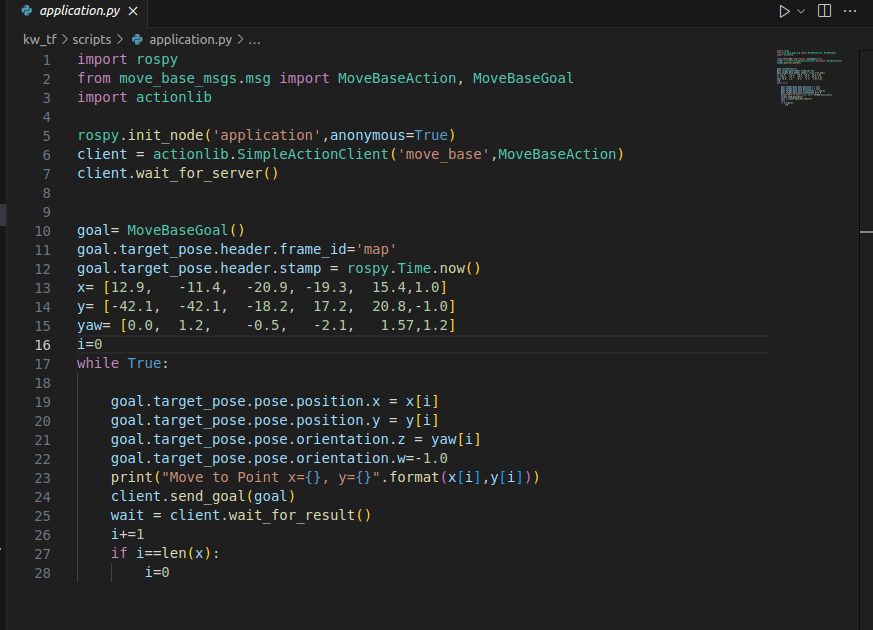

# Wego Scout MiniK Lidar Navigation

## 목표
- Lidar를 이용해서 맵핑이 된 맵내에서 목적지를 설정하면 자동으로 로봇이 경로를 계산해서 움직이게 하는 Navigating 주행 구현

## How to Launch?

1. Morai 실행
2. sensor (Lidar - Ros frame_id = lidar) 연결 
3. source devel/setup.bash -> 없으면 catkin_make
4. roslaunch rosbridge_server rosbridge_websokect.launch
5. roslaunch kw_tf tf_setting.launch
6. roslaunch point_cloud_to_laserscan sample_node.launch
7. roslaunch kw_tf navigation.launch
   
이렇게 까지 하면 rviz가 켜지고 목적지 설정하면 로봇이 자동으로 경로를 계획하고 이동함
---

## 주요 알고리즘 및 프로그램
   1. AMCL(Adaptive Monte Carlo Localization)
      - 로봇의 위치를 추정하고 보정하기 위해서 만든 알고리즘
      - Lidar로부터 받은 데이터에 Paticle 필터를 이용해서 로봇의 위치를 확률적으로 계산
   2. DWA(Dynamic Window Approach)
      - 로봇의 속도 탐색 영역에서 로봇과 충돌 가능한 장애물을 회피 하면서, 목표점까지 빠르게 도달할 수 있는 속도를 선택
   3. Odometry(ROS Open Source, 주행기록계)
      - 로봇의 처음위치는 모르나, 이동한 거리,이동한 좌표, 각각의 모터에 걸린 속도 등을 저장한다. 
   5. costmap (ROS Open Source, 충돌방지 및 경로 최적화)
      - 아래 사진을 보면 빨간부분은 실제로 장애물을 뜯하고, 파란 부분은 충돌을 방지하고자 장애물 주변으로 설정해놓는 금지구역이다. 이 파란 영역을 얼마나 넓게 설정하거나 좁게 설정하는것에 따라 로봇의 경로 계획이 달라지며, 그에 따른 최단거리 및 최단시간이 변화한다.
   

# Gmapping 
- How to Launch의 6번에서 시작
- rosrun map_server map_saver 실행
- 그럼 rviz창과 빈 화면이 나오는데 로봇을 움직이면 3초 간격으로 map이 업데이트 된다.
- 저장을 완료 하려면 map_saver를 끄면 된다. 그럼 파일은 처음 시작 폴더에 map.png와 map.yaml 파일이 생겨난다.

- Gmap 세이브

---
# Navigation
- How to Launch 7번에서 시작
- navigation.launch를 실행 하면, rviz 창이 열림
- rviz창에서 상단의 녹색의 2D Nav goal를 맵에 설정
- 만약에 로봇의 현재 위치와 맵 상의 위치가 맞지 않으면 상단의 2D Pose Estimate 실행해서 로봇의 위치를 교정
- Nav goal를 설정하면 로봇이 알아서 goal로 향하는 경로를 만든 후(rviz상에 표시) goal를 향해 이동한다.

- Gmap 네비게이션

# WayPoint Move(ros action 사용)
- (조건 : Gmapping이 완료)
- kw_slam_ws의 kw_tf 패키지 내부에 maps폴더를 만들고 Map 파일들을 폴더안에 넣기 또는 navigator.launch 파일에서 map 경로 수정
8. How to launch에서 (kw_slam_ws)에 있다고 가정 cd src/kw_tf/scripts/
9. python application.py -> 지정된 Waypoint로 이동

### 만약에 경로가 생기고 안움직이면 Morai Drive Info에서 Automode로 변경
### Lidar 맵이 생기지 않는다 -> sudo apt install ros-slam-gmapping 설치
Ros_Point Move Demo

[Demo](https://drive.google.com/file/d/1g06gLS2Wv0s3-Mejqg12iqbUHV-qZH5K/view?usp=sharing)
